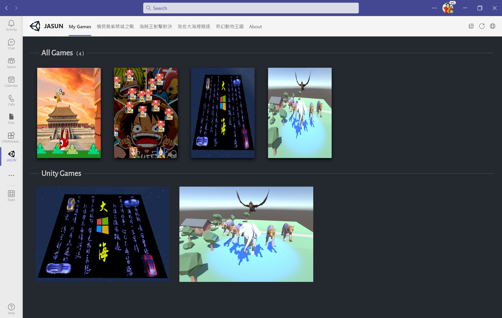
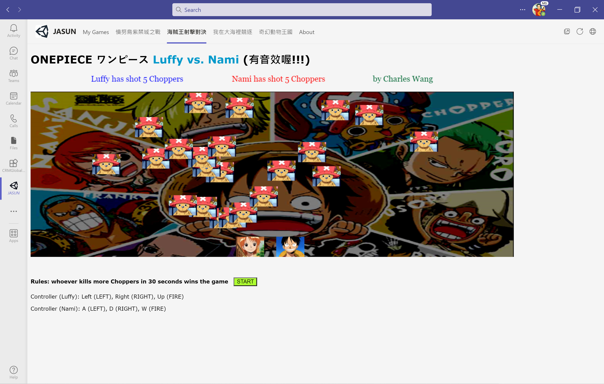
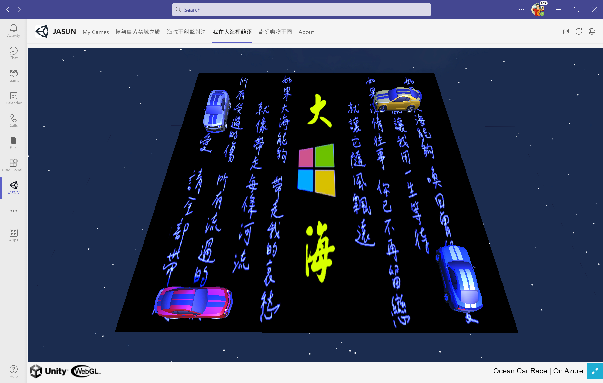

# teams-dev

## Videos

1. [Microsoft Teams開發工具以及應用平台開發](https://www.youtube.com/watch?v=l2vu8h08vcw)

2. [从零开始开发一款属于你的Microsoft Teams小程序！](https://www.youtube.com/watch?v=KdzVSnFkJjE)

3. [Building games with Unity and Azure](https://docs.microsoft.com/en-us/shows/on-net/building-games-with-unity-and-azure)

## Documentation

1. [Build apps with the Teams Toolkit and Visual Studio Code](https://docs.microsoft.com/en-us/microsoftteams/platform/toolkit/visual-studio-code-overview)

2. [Microsoft Teams developer documentation](https://docs.microsoft.com/zh-tw/microsoftteams/platform/)

3. [Unity Tools for Azure DevOps](https://unitydevops.com/)

4. [Azure App Services for Unity](https://github.com/Unity3dAzure/AppServices)

5. [Azure for Game Developers documentation](https://docs.microsoft.com/en-us/previous-versions/sandbox/gamedev/?WT.mc_id=ondotnet-channel9-cephilli)

6. [Hosting your Unity game on Azure](https://techcommunity.microsoft.com/t5/educator-developer-blog/hosting-your-unity-game-on-azure/ba-p/379490)

7. [Build apps for Microsoft Teams with .NET](https://devblogs.microsoft.com/visualstudio/build-apps-for-microsoft-teams-with-net/?WT.mc_id=DT-MVP-4015686&fbclid=IwAR34516VpmH60Y1d0YnVBdeB_btxIZUw3-4YD5bqG9v3MbcIGwqG2c0KCIw)

8. [Microsoft Teams Samples](https://github.com/OfficeDev/Microsoft-Teams-Samples/tree/main/samples)

9. [Teams App Example by Tony Xia](https://tony-xia.github.io/)

10. [开发环境和工具](https://teamsplatform.xizhang.com/dev-team-perspective-of-the-platform/dev-env-and-tools.html)

11. [使用 Teams Toolkit 開發 Teams 應用程式：起手式](https://blog.miniasp.com/post/2022/01/29/Develop-Teams-apps-using-Teams-Toolkit)

12. [發佈使用 Teams 應用程式提交 API 提交的自訂應用程式](https://docs.microsoft.com/zh-tw/microsoftteams/submit-approve-custom-apps)

## Screenshots

- local debug (F5)

