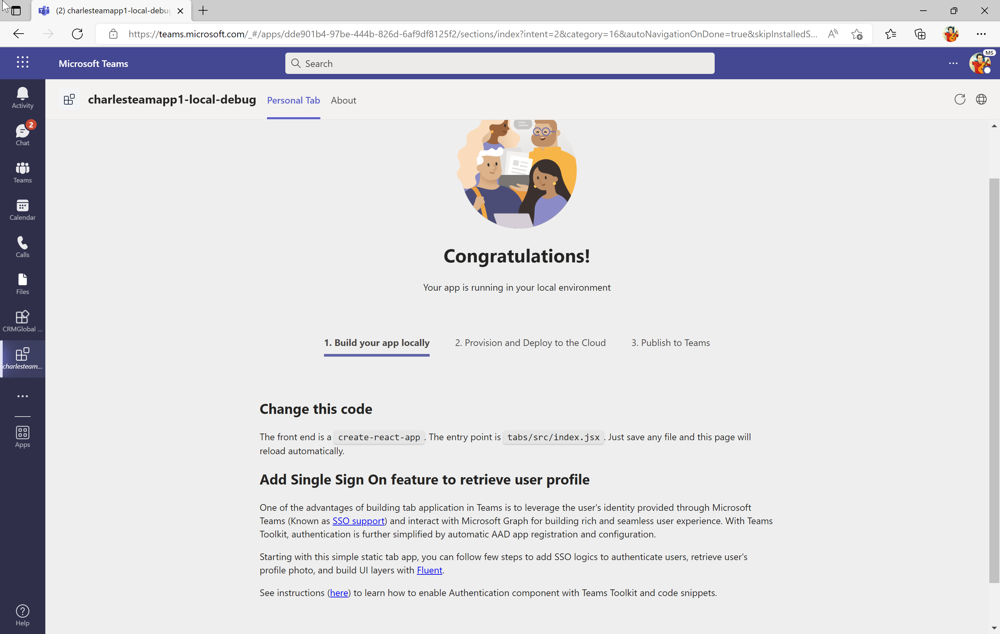
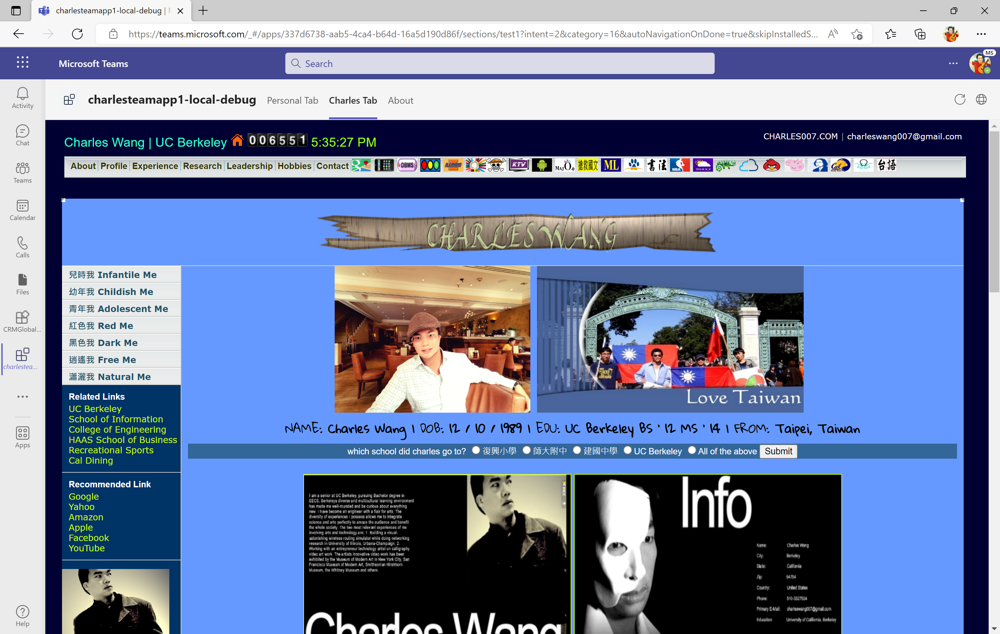
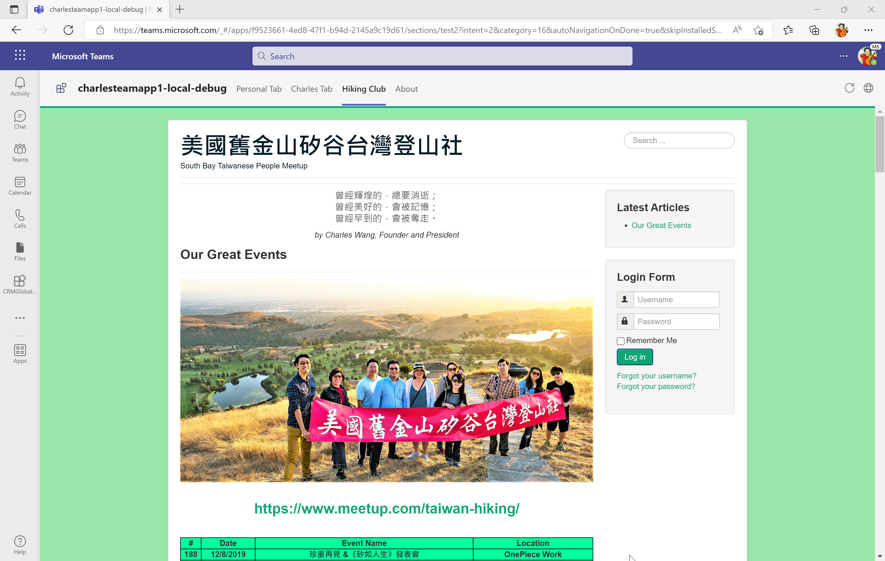
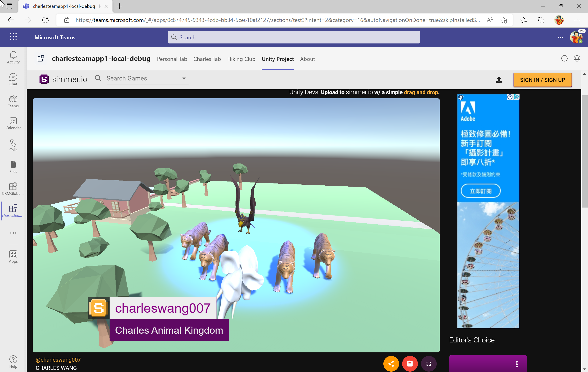

# teams-dev

## Videos

1. [Microsoft Teams開發工具以及應用平台開發](https://www.youtube.com/watch?v=l2vu8h08vcw)

2. [从零开始开发一款属于你的Microsoft Teams小程序！](https://www.youtube.com/watch?v=KdzVSnFkJjE)

## Documentation

1. [Build apps with the Teams Toolkit and Visual Studio Code](https://docs.microsoft.com/en-us/microsoftteams/platform/toolkit/visual-studio-code-overview)

## Screenshots

- local debug (F5)

